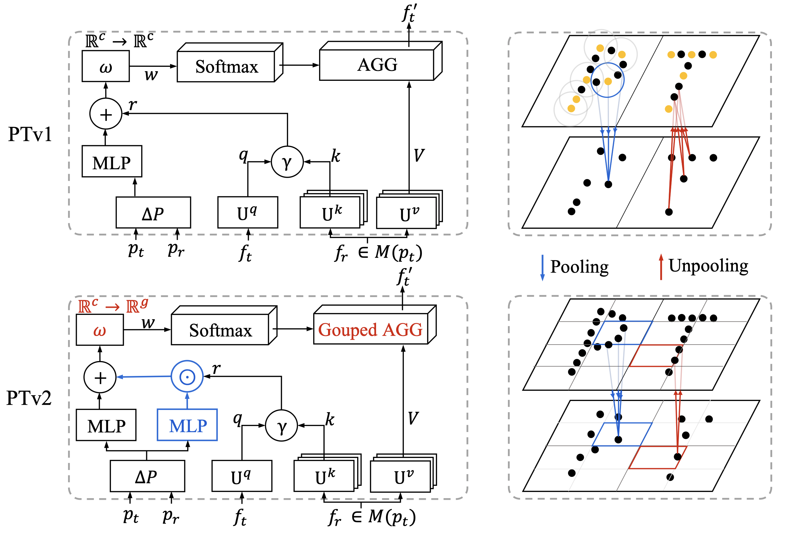

# Point Transformer V2
<p align="center">
  
</p>

This is an official implementation of the paper [Point Transformer V2: Grouped Vector Attention and Partition-based Pooling](https://arxiv.org/abs/2210.05666) (NeurIPS 2022):

```tex
@inproceedings{wu2022point,
  title     = {Point transformer V2: Grouped Vector Attention and Partition-based Pooling},
  author    = {Wu, Xiaoyang and Lao, Yixing and Jiang, Li and Liu, Xihui and Zhao, Hengshuang},
  booktitle = {NeurIPS},
  year      = {2022}
}
```

This is also an all-in-one codebase for point cloud recognition.

Our code will be available in December 2022.
